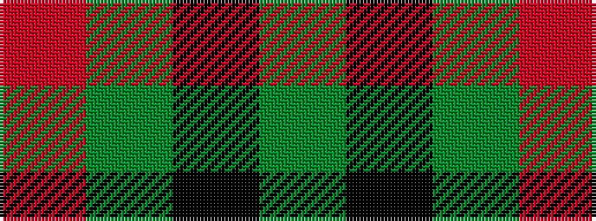

GKGR

It is a 4 stripe tartan.

<figure class="pat-woven">

<figcaption>idealised sample</figcaption>
</figure>

## Colour Sequence



## Tartans with this colour sequence

| Tartans |
|---------------|
| [Kincaid of Kincaid](/variants/s4/g16k11g16r2~x4/)|
||
| [Wilson's No.094](/variants/s4/g4k5g4r2~x2/)|
||
