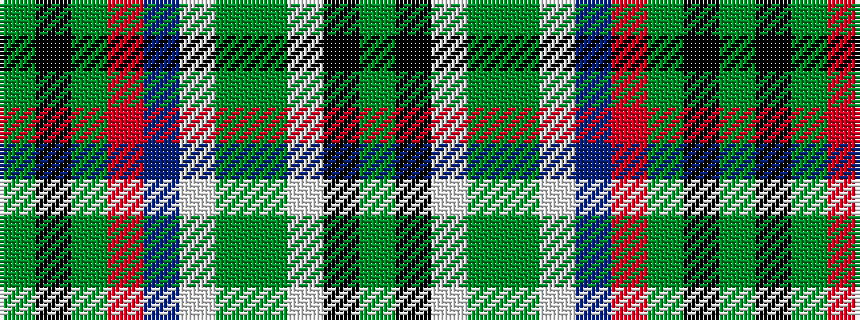

GKGRBWGGWKG

It is a 11 stripe tartan.

<figure class="pat-woven">

<figcaption>idealised sample</figcaption>
</figure>

## Colour Sequence



## Tartans with this colour sequence

| Tartans |
|---------------|
| [MacCulloch Dress (Name)](/variants/s11/dy5k3g2r20db10w2g1dy1w20k4dy3~x2/)|
||
