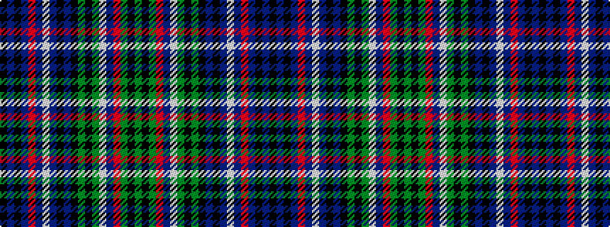

GKGRBWGKGKBKBWBRBKBK

It is a 20 stripe tartan.

<figure class="pat-woven">

<figcaption>idealised sample</figcaption>
</figure>

## Colour Sequence



## Tartans with this colour sequence

| Tartans |
|---------------|
| [Shaw of Carolina (Personal)](/variants/s20/g6k3g18r4db4w4g18k3g6k3db6k3db18w4db4r4db18k3db6k3~x2/)|
||
