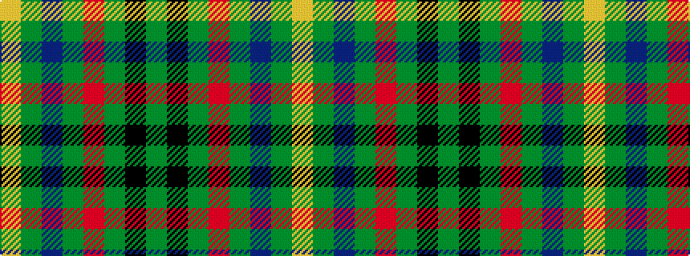

GKGRGBGY

It is a 8 stripe tartan.

<figure class="pat-woven">

<figcaption>idealised sample</figcaption>
</figure>

## Colour Sequence



## Tartans with this colour sequence

| Tartans |
|---------------|
| [Taylor](/variants/s8/g8k2g13r4g12db22g5ly3~x2/)|
||
| [Taylor Family Tartan](/variants/s8/g8k2g13r4g12dp22g5ly3~x2/)|
||
