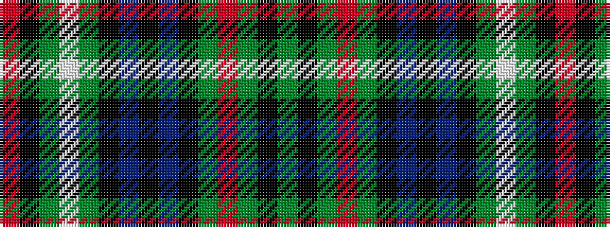

GKGRGKBKBKGWGKR

It is a 15 stripe tartan.

<figure class="pat-woven">

<figcaption>idealised sample</figcaption>
</figure>

## Colour Sequence



## Tartans with this colour sequence

| Tartans |
|---------------|
| [MacRae](/setts/s15/g6k3g7r3g6k13db13k3db13k13g3w3g6k3r4~x2/)|
||
| [MacRae #2](/setts/s15/dg6k3dg7r3dg6k13db13k3db13k13dg3w3dg6k3r4~x2/)|
||
