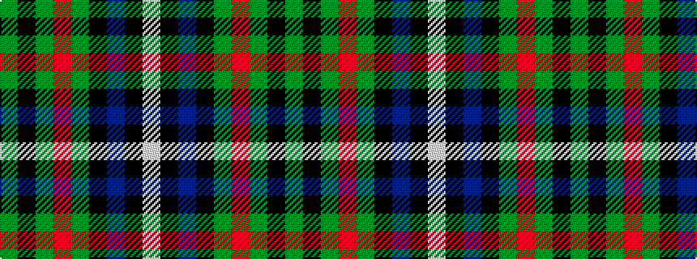

GKGRGKBKW

It is a 9 stripe tartan.

<figure class="pat-woven">

<figcaption>idealised sample</figcaption>
</figure>

## Colour Sequence



## Tartans with this colour sequence

| Tartans |
|---------------|
| [MacRae Hunting #2](/variants/s9/g14k2g4r2g4k14dp15k1w3~x2/)|
||
| [MacRae, hunting](/variants/s9/dg14k2dg4r2dg4k14p15k1w3~x2/)|
||
