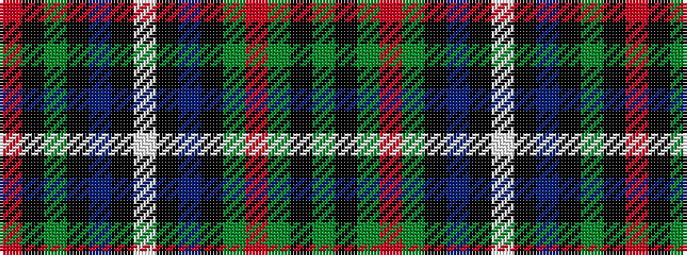

GKGRGKBKWKBKGKR

It is a 15 stripe tartan.

<figure class="pat-woven">

<figcaption>idealised sample</figcaption>
</figure>

## Colour Sequence



## Tartans with this colour sequence

| Tartans |
|---------------|
| [MacRae Htg - 1820 (Wilsons)](/setts/s15/dg26k4dg6r4dg6k26db26k3w7k3db26k26dg26k3r7~x2/)|
||
| [MacRae Hunting (Wilsons)](/setts/s15/g26k4g6m4g6k26db26k3w7k3db26k26g26k3m7~x2/)|
||
| [MacRae, hunting](/setts/s15/g26k4g6r4g6k26db26k3w7k3db26k26g26k3r7~x2/)|
||
