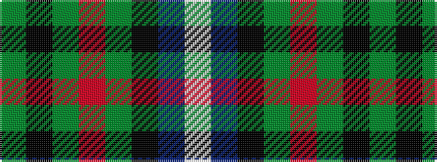

GKGRGKBW

It is a 8 stripe tartan.

<figure class="pat-woven">

<figcaption>idealised sample</figcaption>
</figure>

## Colour Sequence



## Tartans with this colour sequence

| Tartans |
|---------------|
| [Dunfermline Bank of Scotland (Corp)](/setts/s8/dg24k5dg6r6dg6k20b20w2~x2/)|
||
| [MacRae Hunting](/setts/s8/dg24k4dg6r4dg6k19dt22w5~x2/)|
||
| [MacRae, Ancient hunting](/setts/s8/g24k4g6r4g6k19db22w5~x2/)|
||
