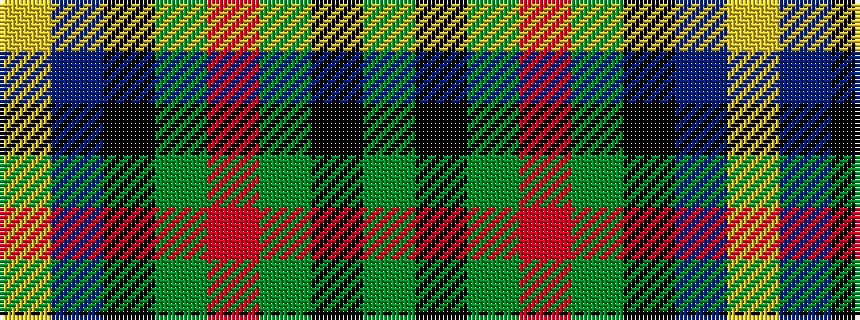

GKGRGKBY

It is a 8 stripe tartan.

<figure class="pat-woven">

<figcaption>idealised sample</figcaption>
</figure>

## Colour Sequence



## Tartans with this colour sequence

| Tartans |
|---------------|
| [Guelph, City Of](/variants/s8/g12k1g2r1g2k10db10lo1~x4/)|
||
