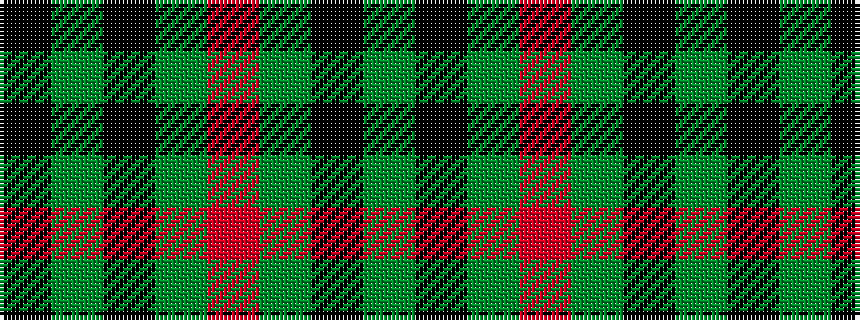

GKGRGKGK

It is a 8 stripe tartan.

<figure class="pat-woven">

<figcaption>idealised sample</figcaption>
</figure>

## Colour Sequence



## Tartans with this colour sequence

| Tartans |
|---------------|
| [MacArthur-Fox (Personal)](/variants/s8/k8g3k4g20r3~x2/)|
||
