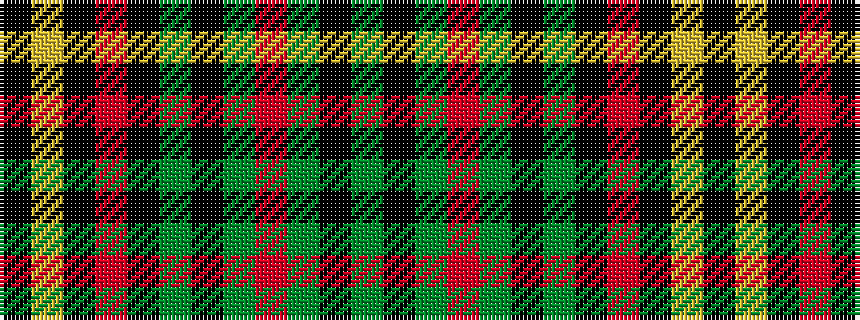

GKGRGKGKRKYK

It is a 12 stripe tartan.

<figure class="pat-woven">

<figcaption>idealised sample</figcaption>
</figure>

## Colour Sequence



## Tartans with this colour sequence

| Tartans |
|---------------|
| [Ulster](/variants/s12/g13k1g13r1g1k1g1k1r13k1ly1k1~x3/)|
||
| [Ulster Red (District)](/variants/s12/g10k1g10r1g1k1g1k1r10k1lo1k1~x4/)|
||
