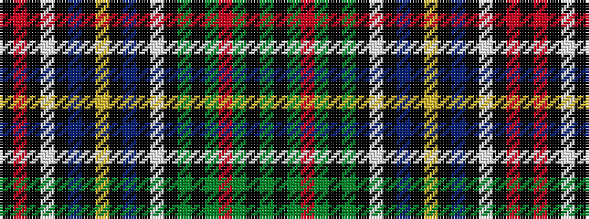

GKGRGKGKWKBKYKBKWKRK

It is a 20 stripe tartan.

<figure class="pat-woven">

<figcaption>idealised sample</figcaption>
</figure>

## Colour Sequence



## Tartans with this colour sequence

| Tartans |
|---------------|
| [Jones, Melnyk (Personal)](/setts/s20/g5k5g5r12g3k15g3k2w1k2t7k2ly10k2t7k2w1k3r15k3~x2/)|
||
