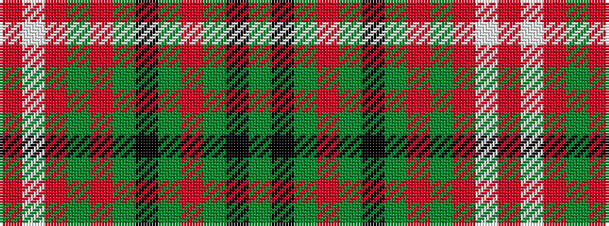

GKGRGKGRGRWR

It is a 12 stripe tartan.

<figure class="pat-woven">

<figcaption>idealised sample</figcaption>
</figure>

## Colour Sequence



## Tartans with this colour sequence

| Tartans |
|---------------|
| [Kelly of Sleat Hunting (Name)](/setts/s12/dg8k8dg56o8dg8k20dg8o8dg8o16w3r6/)|
||
