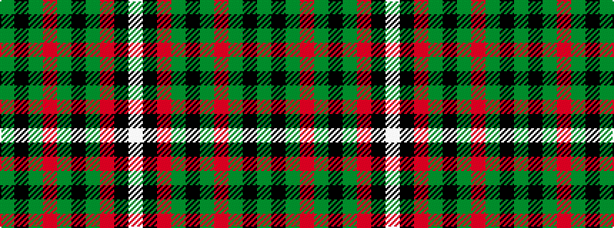

GKGRGKGRKW

It is a 10 stripe tartan.

<figure class="pat-woven">

<figcaption>idealised sample</figcaption>
</figure>

## Colour Sequence



## Tartans with this colour sequence

| Tartans |
|---------------|
| [MacCarthy (Fashion?)](/variants/s10/g2k1g14r2g2k10g2r4k1w2~x4/)|
||
