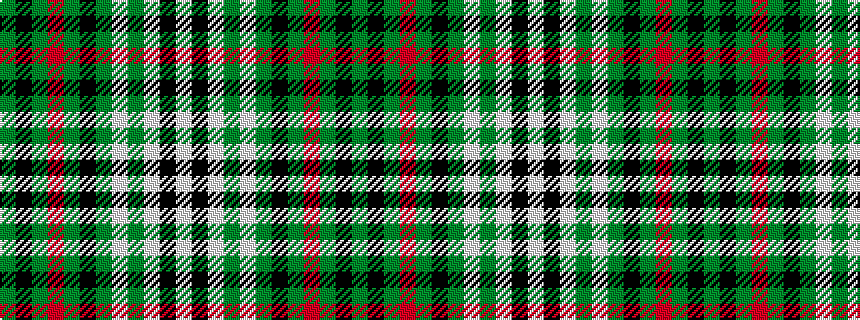

GKGRGKGWGWKW

It is a 12 stripe tartan.

<figure class="pat-woven">

<figcaption>idealised sample</figcaption>
</figure>

## Colour Sequence



## Tartans with this colour sequence

| Tartans |
|---------------|
| [Moss](/variants/s12/g4k2g28r4g4k18g4lp4g4lp7k1w3~x2/)|
||
