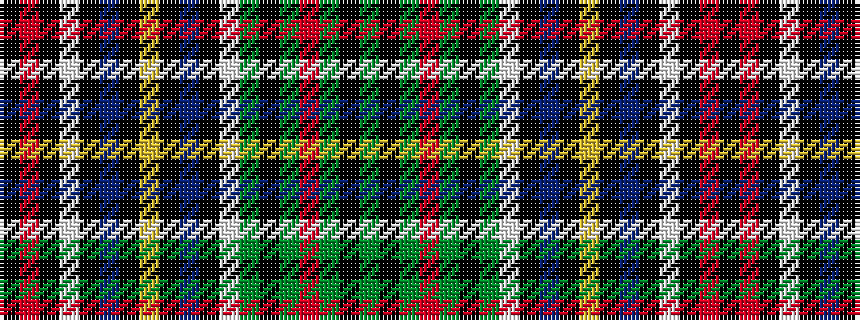

GKGRGKGWKBKYKBKWKRK

It is a 19 stripe tartan.

<figure class="pat-woven">

<figcaption>idealised sample</figcaption>
</figure>

## Colour Sequence



## Tartans with this colour sequence

| Tartans |
|---------------|
| [Melnyk-Jones (Personal)](/variants/s19/dg5k5dg5r12dg3k15dg3w1k2n7k2lo10k2n7k2w1k3r15k3~x2/)|
||
