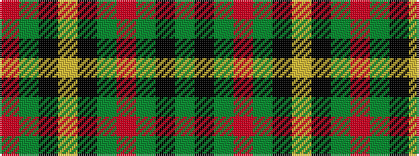

GKGRGKYKGR

It is a 10 stripe tartan.

<figure class="pat-woven">

<figcaption>idealised sample</figcaption>
</figure>

## Colour Sequence



## Tartans with this colour sequence

| Tartans |
|---------------|
| [MacAart (Personal)](/variants/s10/dy9k2dy2r2g6k1lo1k1g6r3~x4/)|
||
| [MacAart Family Tartan](/variants/s10/dy9k2dy2r2g6k1ly1k1g6r3~x2/)|
||
