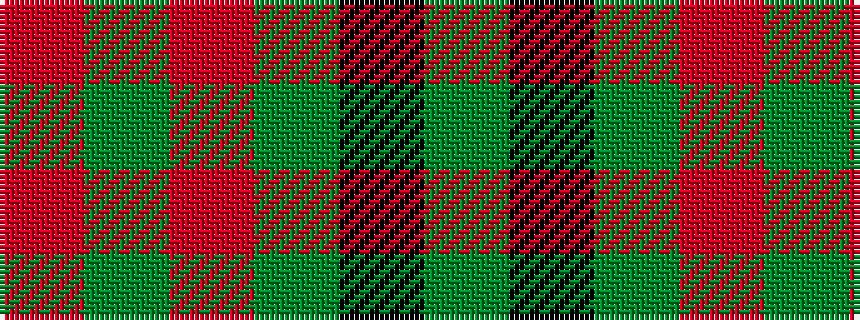

GKGRGR

It is a 6 stripe tartan.

<figure class="pat-woven">

<figcaption>idealised sample</figcaption>
</figure>

## Colour Sequence



## Tartans with this colour sequence

| Tartans |
|---------------|
| [Loch Laggan](/setts/s6/r19g6r7g101k7g7/)|
||
| [Loch Laggan (District)](/setts/s6/r4g2r1g20k1g1~x4/)|
||
| [MacGregor, Glengyle](/setts/s6/r96g42r16g17k4y6/)|
||
