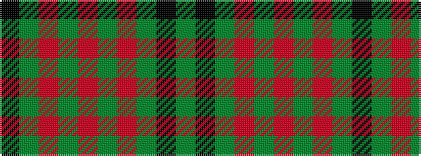

GKGRGRGRGK

It is a 10 stripe tartan.

<figure class="pat-woven">

<figcaption>idealised sample</figcaption>
</figure>

## Colour Sequence



## Tartans with this colour sequence

| Tartans |
|---------------|
| [Loch Laggan](/setts/s10/r4g2r1g19k1g2~x4/)|
||
