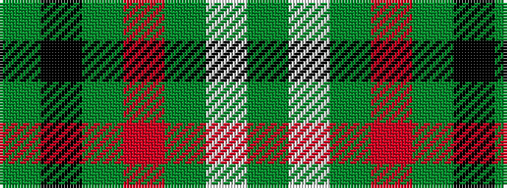

GKGRGWG

It is a 7 stripe tartan.

<figure class="pat-woven">

<figcaption>idealised sample</figcaption>
</figure>

## Colour Sequence



## Tartans with this colour sequence

| Tartans |
|---------------|
| [Arkansas](/setts/s7/g3w1g12r6g3k3g2~x4/)|
||
| [Arkansas](/setts/s7/dg3w1dg12r6dg3k3g2~x4/)|
||
