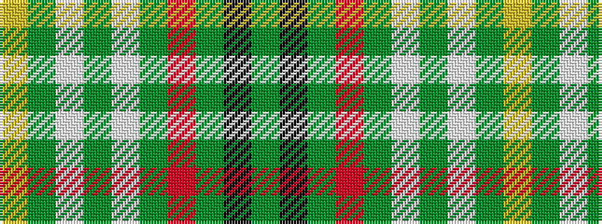

GKGRGWGWGY

It is a 10 stripe tartan.

<figure class="pat-woven">

<figcaption>idealised sample</figcaption>
</figure>

## Colour Sequence



## Tartans with this colour sequence

| Tartans |
|---------------|
| [Taylor, dress](/variants/s10/g9k2g15r4g14w3y3w23g5ly3~x2/)|
||
