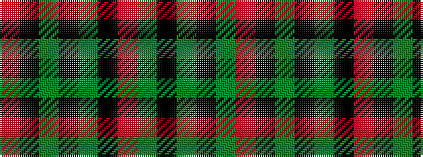

GKGRKGKGKR

It is a 10 stripe tartan.

<figure class="pat-woven">

<figcaption>idealised sample</figcaption>
</figure>

## Colour Sequence



## Tartans with this colour sequence

| Tartans |
|---------------|
| [MacArthur-Fox 2000 (Personal)](/variants/s10/y5k2y30r2k10y5k2y5k10r2~x2/)|
||
