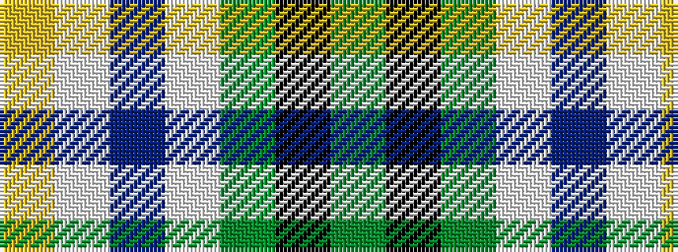

GKGWBWY

It is a 7 stripe tartan.

<figure class="pat-woven">

<figcaption>idealised sample</figcaption>
</figure>

## Colour Sequence



## Tartans with this colour sequence

| Tartans |
|---------------|
| [Pinder, Nigel (Personal)](/variants/s7/g12k4g12w1b6w1ly4~x4/)|
||
