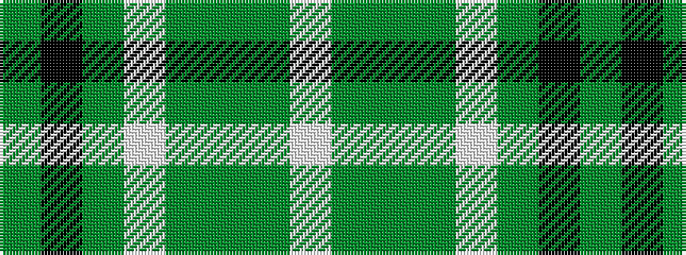

GKGWGGGW

It is a 8 stripe tartan.

<figure class="pat-woven">

<figcaption>idealised sample</figcaption>
</figure>

## Colour Sequence



## Tartans with this colour sequence

| Tartans |
|---------------|
| [Pavelka Ltd](/variants/s8/dy3k48dy5w3dy3g2gi5lb3~x2/)|
||
