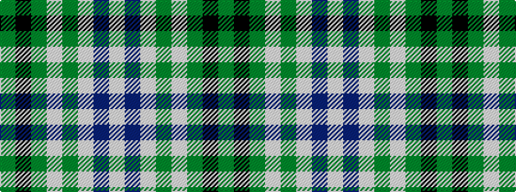

GKGWGWBW

It is a [8 stripe pattern](/stripes/stripes8/) — every 8-stripe pattern is gathered there.

<figure class="pat-woven">

<figcaption>idealised sample</figcaption>
</figure>

## Colour Sequence



## Tartans with this colour sequence

This pattern is a design lineage: every tartan below shares one colour order, whatever its owner —
near-identical designs are grouped, the largest lineage first (#112: the pattern is a tartan's
second parent, beside its family or clan).

<table class="sett-table">
<tbody>
<tr><td><a href="/tartans/l/l/l-abeille-du-cercle-de-fermi-res-sainte-genevi-ve-de-sainte-foy/">L'Abeille du Cercle de Fermières Sainte-Geneviève-de-Sainte-Foy</a></td></tr>
<tr><td class="sett-swatch"></td></tr>
</tbody>
</table>

