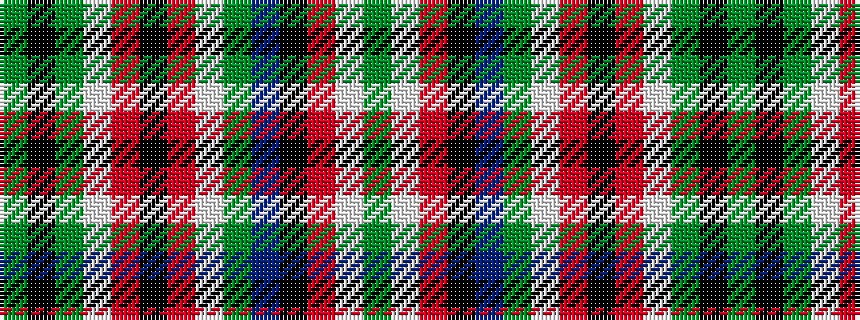

GKGWRKRWGBKRWG

It is a 14 stripe tartan.

<figure class="pat-woven">

<figcaption>idealised sample</figcaption>
</figure>

## Colour Sequence



## Tartans with this colour sequence

| Tartans |
|---------------|
| [MacFarlane Hunting Clan Tartan](/variants/s14/g16k3g20w2r3k2r3w2g2db18k2r4w2g3~x2/)|
||
| [MacFarlane, hunting](/variants/s14/g64k3g20w2r3k2r3w2g2db18k2r4w2g3~x2/)|
||
