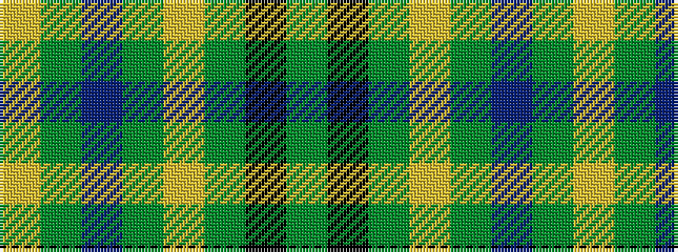

GKGYGBGY

It is a 8 stripe tartan.

<figure class="pat-woven">

<figcaption>idealised sample</figcaption>
</figure>

## Colour Sequence



## Tartans with this colour sequence

| Tartans |
|---------------|
| [Taylor](/setts/s8/g8k2g13lr4g12n22g5lo3~x2/)|
||
