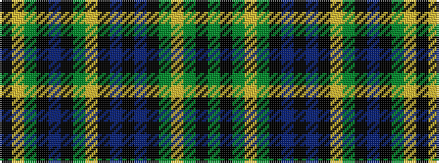

GKGYGKBKBKYGKBKGYK

It is a 18 stripe tartan.

<figure class="pat-woven">

<figcaption>idealised sample</figcaption>
</figure>

## Colour Sequence



## Tartans with this colour sequence

| Tartans |
|---------------|
| [Raznotravie](/variants/s18/k10ly1y2k1dt2k1y2ly1k1dt2k3dt1k17y18ly1y2k1dg2~x2/)|
||
