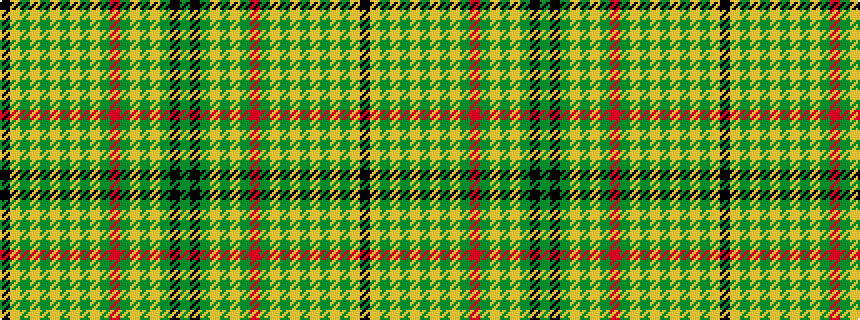

GKGYGYGRGYGYGYGYGYK

It is a 19 stripe tartan.

<figure class="pat-woven">

<figcaption>idealised sample</figcaption>
</figure>

## Colour Sequence



## Tartans with this colour sequence

| Tartans |
|---------------|
| [Peeper (check)](/variants/s19/g4k1y4lo4y4lo4y4r5y4lo4y4lo4y4lo4y4lo4y4lo4k1~x2/)|
||
