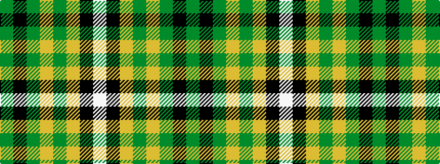

GKGYGYKW

It is a 8 stripe tartan.

<figure class="pat-woven">

<figcaption>idealised sample</figcaption>
</figure>

## Colour Sequence



## Tartans with this colour sequence

| Tartans |
|---------------|
| [Keogh (Name?)](/setts/s8/g29k4gi6lo4gi28loi28k1lb5~x2/)|
||
