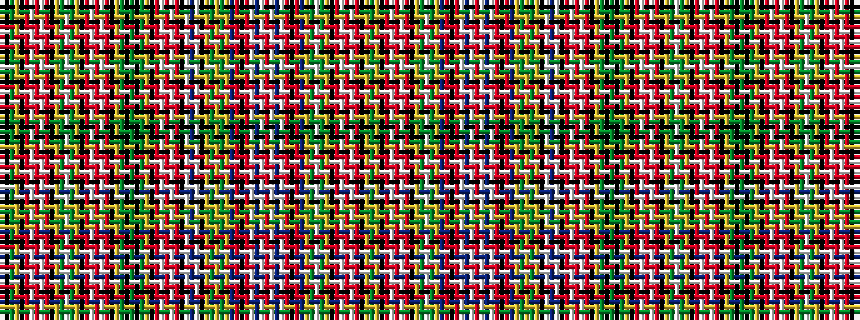

GKGYKRWRWRKYGWGYKRWRWRKYGKGKGYKRWRWRKWBWKYGYGYBRKRWBWRWBWRKRBYGWGYKRWRWRKYG

It is a 75 stripe tartan.

<figure class="pat-woven">

<figcaption>idealised sample</figcaption>
</figure>

## Colour Sequence



## Tartans with this colour sequence

| Tartans |
|---------------|
| [Ogilvie 2](/setts/s75/g14k4g14ly4k2r8w2r8w2r8k2ly2g8w2g8ly2k2r8w2r8w2r8k2ly2g14k4g14k4g14ly2k2r8w2r8w2r8k12w1db4w1k12ly4g6ly2g6ly4p2r4k2r14w1db2w1r14w1db2w1r14k2r4p2ly2g8w2g8ly2k2r8w2r8w2r8k2ly4g8~x2/)|
||
