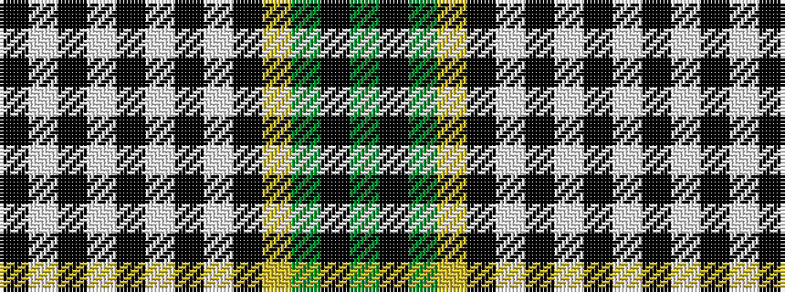

GKGYKWKWKWKWK

It is a 13 stripe tartan.

<figure class="pat-woven">

<figcaption>idealised sample</figcaption>
</figure>

## Colour Sequence



## Tartans with this colour sequence

| Tartans |
|---------------|
| [Currie of Balilone (Variant Franklin)](/setts/s13/dg30k1dg2lo2k2w1k12w1k2w2k2w1k6~x2/)|
||
