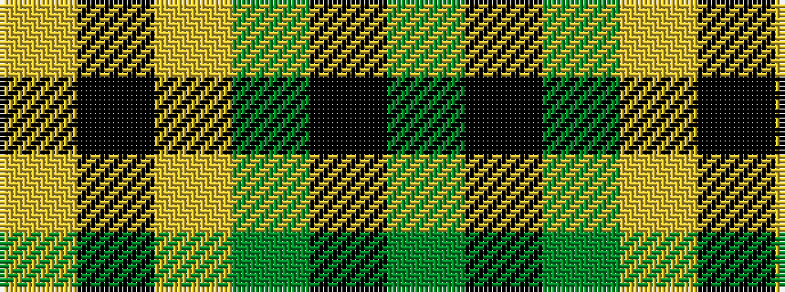

GKGYKY

It is a 6 stripe tartan.

<figure class="pat-woven">

<figcaption>idealised sample</figcaption>
</figure>

## Colour Sequence



## Tartans with this colour sequence

| Tartans |
|---------------|
| [Hage-West (Personal)](/setts/s6/dg8k8dg8ly6k3ly6~x2/)|
||
