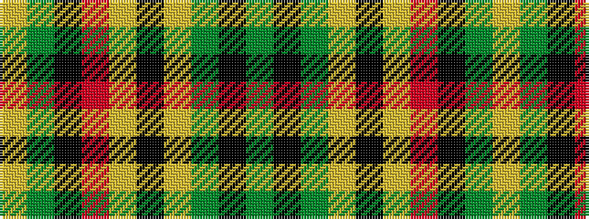

GKGYKYRKGY

It is a 10 stripe tartan.

<figure class="pat-woven">

<figcaption>idealised sample</figcaption>
</figure>

## Colour Sequence



## Tartans with this colour sequence

| Tartans |
|---------------|
| [Antrim](/setts/s10/g5k2g17ly2k5ly2r5k17g2ly4~x2/)|
||
