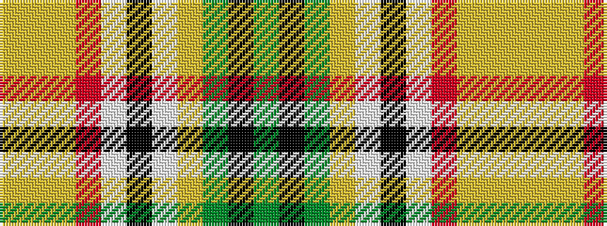

GKGYWKWRYYY

It is a 11 stripe tartan.

<figure class="pat-woven">

<figcaption>idealised sample</figcaption>
</figure>

## Colour Sequence



## Tartans with this colour sequence

| Tartans |
|---------------|
| [Asman, Day Tan (Name)](/variants/s11/y2k1y9loi3lb1k3lb1r3loi9lo1loi2~x4/)|
||
