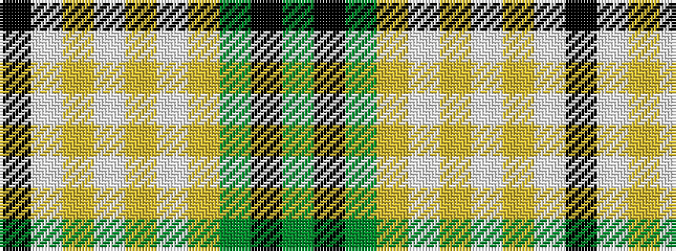

GKGYWYWYWK

It is a 10 stripe tartan.

<figure class="pat-woven">

<figcaption>idealised sample</figcaption>
</figure>

## Colour Sequence



## Tartans with this colour sequence

| Tartans |
|---------------|
| [Wcwm 1399](/setts/s10/k44lb3lo16lb2lo2lb2lo2y10k3y8~x2/)|
||
