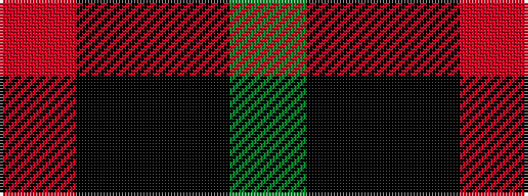

GKKR

It is a 4 stripe tartan.

<figure class="pat-woven">

<figcaption>idealised sample</figcaption>
</figure>

## Colour Sequence



## Tartans with this colour sequence

| Tartans |
|---------------|
| [Feddinch Club, St Andrews Limited, The](/variants/s4/dg43k14ki14r2~x2/)|
||
