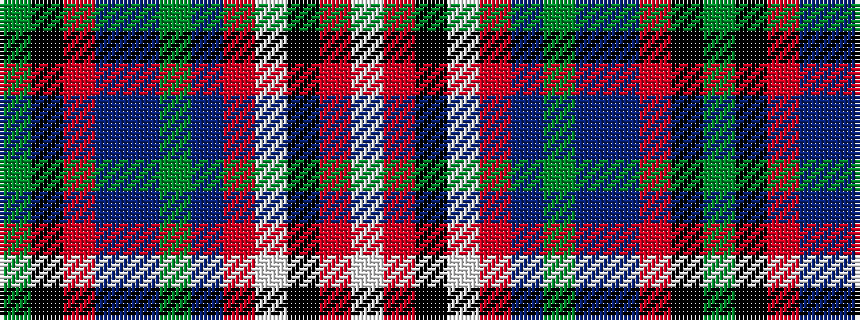

GKRBBGBRWKRW

It is a 12 stripe tartan.

<figure class="pat-woven">

<figcaption>idealised sample</figcaption>
</figure>

## Colour Sequence



## Tartans with this colour sequence

| Tartans |
|---------------|
| [Vine (2015)](/setts/s12/dg19k20m1db8b8dg8db3m1lb12k8m1lb1~x2/)|
||
