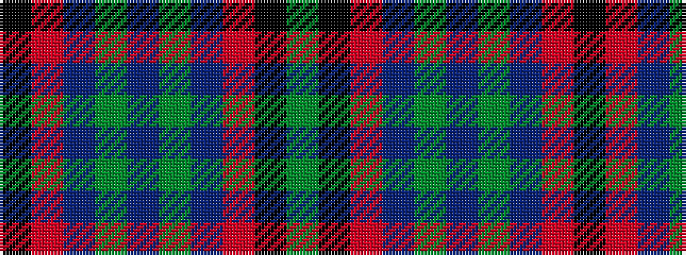

GKRBGBGBRK

It is a 10 stripe tartan.

<figure class="pat-woven">

<figcaption>idealised sample</figcaption>
</figure>

## Colour Sequence



## Tartans with this colour sequence

| Tartans |
|---------------|
| [Ferguson Britt](/setts/s10/k12r1do12dy12do2dy12do12r1k12dy2~x6/)|
||
