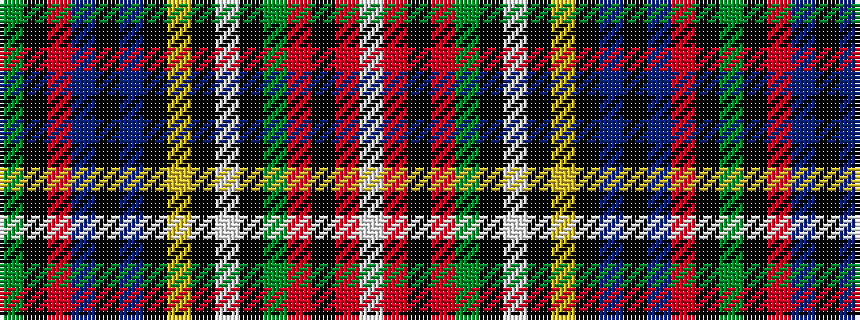

GKRBKBKYKWKGRKRW

It is a 16 stripe tartan.

<figure class="pat-woven">

<figcaption>idealised sample</figcaption>
</figure>

## Colour Sequence



## Tartans with this colour sequence

| Tartans |
|---------------|
| [Wilson's, No 152](/setts/s16/g3k2r12t9k2t9k16ly3k3w5k3g25r13k4r5w3~x2/)|
||
