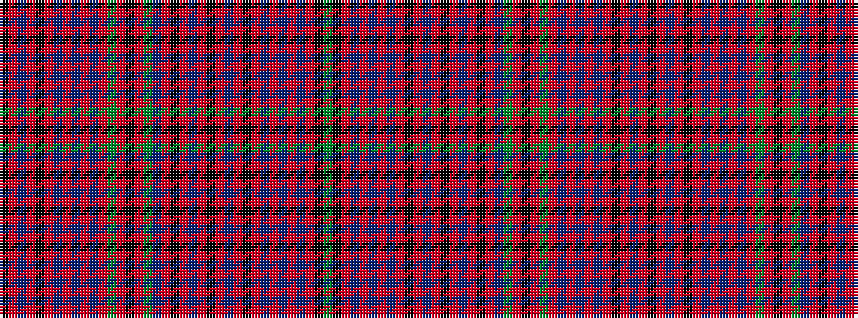

GKRBRBRBRKRBRKRBRKRBGRKRGRBRBRBRKRBRK

It is a 37 stripe tartan.

<figure class="pat-woven">

<figcaption>idealised sample</figcaption>
</figure>

## Colour Sequence



## Tartans with this colour sequence

| Tartans |
|---------------|
| [Unidentified #38](/variants/s37/dg12k1r6db1r1t1r1db1r6k12r1db12r6k1r6db12r1k12r6t1dg12r6k1r6dg12r6db1r1t1r1db1r6k12r1db12r6k1~x2/)|
||
