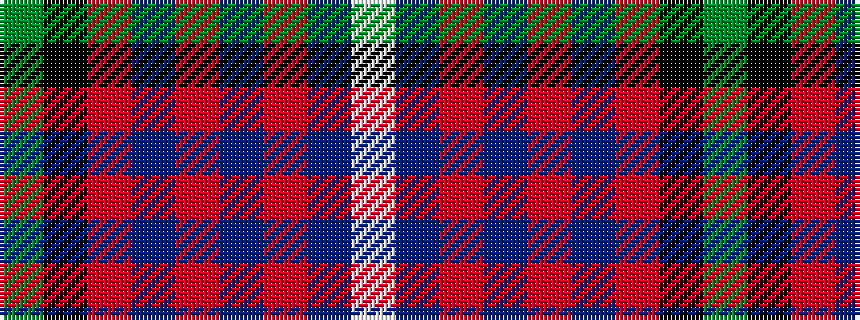

GKRBRBRBW

It is a 9 stripe tartan.

<figure class="pat-woven">

<figcaption>idealised sample</figcaption>
</figure>

## Colour Sequence



## Tartans with this colour sequence

| Tartans |
|---------------|
| [Rattray](/setts/s9/g71k4r4db9r4db4r36db4w4/)|
||
| [Rattray](/setts/s9/g71k4r4dp9r4dp4r36dp4w4/)|
||
| [Rattray](/setts/s9/dg71k4r4db9r4db4r36db4lb4/)|
||
