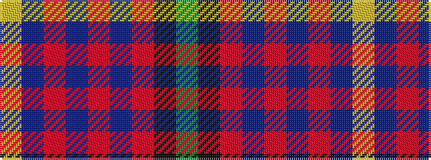

GKRBRBRBY

It is a 9 stripe tartan.

<figure class="pat-woven">

<figcaption>idealised sample</figcaption>
</figure>

## Colour Sequence



## Tartans with this colour sequence

| Tartans |
|---------------|
| [Rattay](/setts/s9/dg71k4r4db9r4db4r36db4lr4~x2/)|
||
| [Rattay](/setts/s9/dg71k4r4db9r4db4r36db4lr4/)|
||
