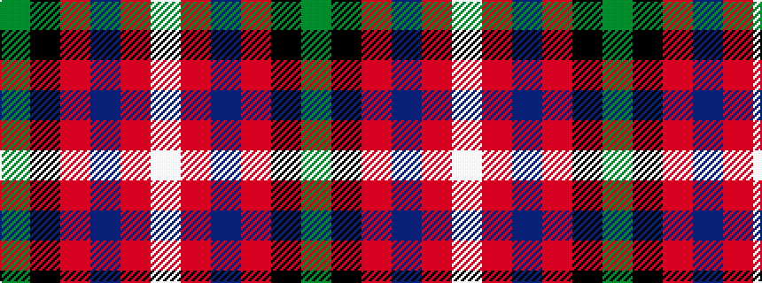

GKRBRW

It is a 6 stripe tartan.

<figure class="pat-woven">

<figcaption>idealised sample</figcaption>
</figure>

## Colour Sequence



## Tartans with this colour sequence

| Tartans |
|---------------|
| [Kinnaird (Name)](/variants/s6/g15k10r30dp2r20w1~x2/)|
||
