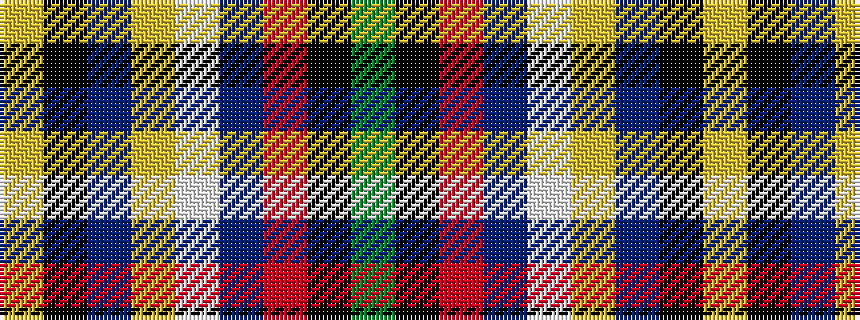

GKRBWYBKY

It is a 9 stripe tartan.

<figure class="pat-woven">

<figcaption>idealised sample</figcaption>
</figure>

## Colour Sequence



## Tartans with this colour sequence

| Tartans |
|---------------|
| [Schreier. Christopher (Personal)](/variants/s9/g22k2r22db2w1lo12dp1k1ly4~x2/)|
||
