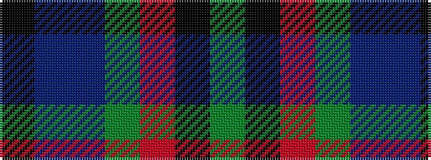

GKRGBBK

It is a 7 stripe tartan.

<figure class="pat-woven">

<figcaption>idealised sample</figcaption>
</figure>

## Colour Sequence



## Tartans with this colour sequence

| Tartans |
|---------------|
| [Cooke](/setts/s7/k6b2db12g8r5k2g3~x4/)|
||
| [Cooke (Personal)](/setts/s7/k6t2db12g8r5k2g3~x4/)|
||
