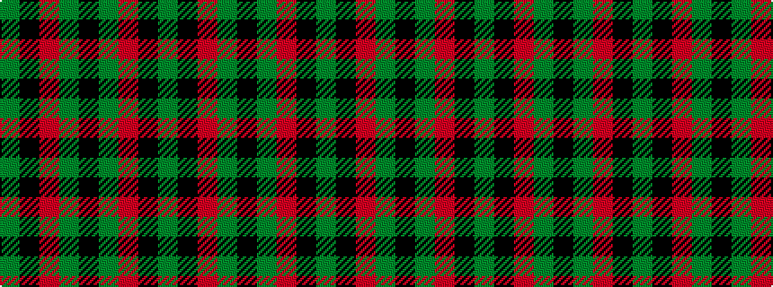

GKRGKGRKG

It is a 9 stripe tartan.

<figure class="pat-woven">

<figcaption>idealised sample</figcaption>
</figure>

## Colour Sequence



## Tartans with this colour sequence

| Tartans |
|---------------|
| [Montrose (Graham)](/variants/s9/y1k1r8dg8k6y4r8k1y1~x8/)|
||
