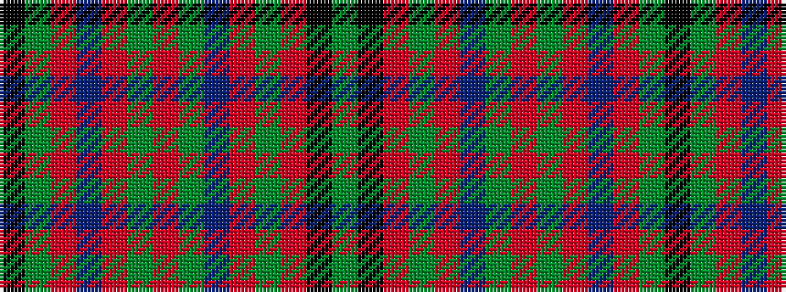

GKRGRBGRGRBRGK

It is a 14 stripe tartan.

<figure class="pat-woven">

<figcaption>idealised sample</figcaption>
</figure>

## Colour Sequence



## Tartans with this colour sequence

| Tartans |
|---------------|
| [MacIntyre and Glenorchy](/variants/s14/k2g2r3dp18r2g6r4y2dp6r3g18r3k2g2~x2/)|
||
