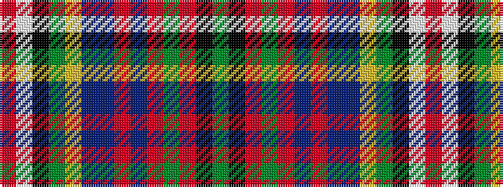

GKRGRBRBBYGKWR

It is a 14 stripe tartan.

<figure class="pat-woven">

<figcaption>idealised sample</figcaption>
</figure>

## Colour Sequence



## Tartans with this colour sequence

| Tartans |
|---------------|
| [Unidentified #31](/setts/s14/r12w1k1dg12ly2db5t6r2t2r4dg2r2k2dg2~x2/)|
||
| [Unnamed 11](/setts/s14/r12w1k1g12ly2db5t6r2t2r4g2r2k2g2~x2/)|
||
