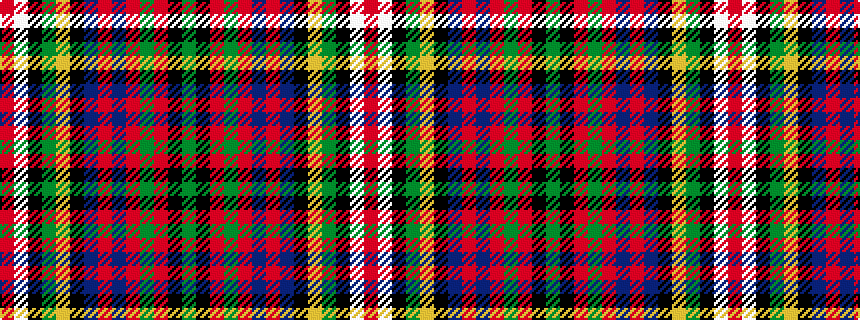

GKRGRBRBKYGKWR

It is a 14 stripe tartan.

<figure class="pat-woven">

<figcaption>idealised sample</figcaption>
</figure>

## Colour Sequence



## Tartans with this colour sequence

| Tartans |
|---------------|
| [Wilson's, No 226](/variants/s14/r25w4k4g25ly3k15t13r5t5r15g4r5k2g3~x2/)|
||
